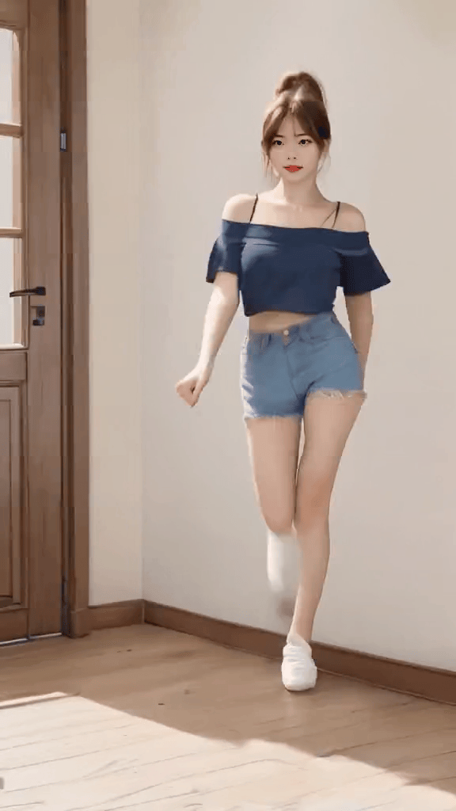
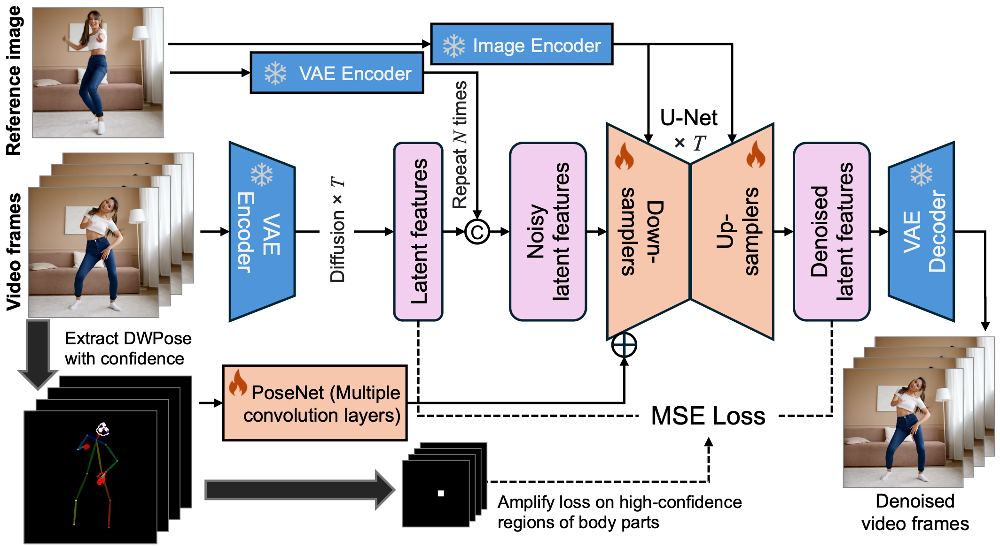

# MimicMotion

<a href='http://tencent.github.io/MimicMotion'></a> <a href='https://arxiv.org/abs/2406.19680'></a> [](https://replicate.com/zsxkib/mimic-motion)

MimicMotion: High-Quality Human Motion Video Generation with Confidence-aware Pose Guidance
<br/>
*Yuang Zhang<sup>1,2</sup>, Jiaxi Gu<sup>1</sup>, Li-Wen Wang<sup>1</sup>, Han Wang<sup>1,2</sup>, Junqi Cheng<sup>1</sup>, Yuefeng Zhu<sup>1</sup>, Fangyuan Zou<sup>1</sup>*
<br/>
[<sup>1</sup>Tencent; <sup>2</sup>Shanghai Jiao Tong University]

<p align="center">
  
  
  
  
  
  
  <br/>
  <span>Highlights: <b>rich details</b>, <b> good temporal smoothness</b>, and <b>long video length</b>. </span>
</p>

## Overview

<p align="center">
  
  </br>
  <i>An overview of the framework of MimicMotion.</i>
</p>

In recent years, generative artificial intelligence has achieved significant advancements in the field of image generation, spawning a variety of applications. However, video generation still faces considerable challenges in various aspects such as controllability, video length, and richness of details, which hinder the application and popularization of this technology. In this work, we propose a controllable video generation framework, dubbed *MimicMotion*, which can generate high-quality videos of arbitrary length with any motion guidance. Comparing with previous methods, our approach has several highlights. Firstly, with confidence-aware pose guidance, temporal smoothness can be achieved so model robustness can be enhanced with large-scale training data. Secondly, regional loss amplification based on pose confidence significantly eases the distortion of image significantly. Lastly, for generating long smooth videos, a progressive latent fusion strategy is proposed. By this means, videos of arbitrary length can be generated with acceptable resource consumption. With extensive experiments and user studies, MimicMotion demonstrates significant improvements over previous approaches in multiple aspects.

## News

* `[2024-07-01]`: Project page, code, technical report and a basic model checkpoint are released. A better checkpoint supporting higher quality video generation will be released very soon. Stay tuned!

## Quickstart

For the initial released version of the model checkpoint, it supports generating videos with a maximum of 16 frames at a 576x1024 resolution. If you encounter insufficient memory issues, you can appropriately reduce the number of frames.

### Environment setup

Recommend python 3+ with torch 2.x are validated with an Nvidia V100 GPU. Follow the command below to install all the dependencies of python:

```
conda env create -f environment.yaml
conda activate mimicmotion
```

### Download weights
Please download weights manually as follows:
```
cd MimicMotions/
mkdir models
```
1. Download SVD model: [stabilityai/stable-video-diffusion-img2vid-xt-1-1](https://huggingface.co/stabilityai/stable-video-diffusion-img2vid-xt-1-1)
    ```
    git lfs install
    git clone https://huggingface.co/stabilityai/stable-video-diffusion-img2vid-xt-1-1
    mkdir -p models/SVD
    mv stable-video-diffusion-img2vid-xt-1-1 models/SVD/
    ```
2. Download DWPose pretrained model: [dwpose](https://huggingface.co/yzd-v/DWPose/tree/main)
    ```
    git lfs install
    git clone https://huggingface.co/yzd-v/DWPose
    mv DWPose models/
    ```
3. Download the pre-trained checkpoint of MimicMotion from [Huggingface](https://huggingface.co/ixaac/MimicMotion)
    ```
    curl -o models/MimicMotion.pth https://huggingface.co/ixaac/MimicMotion/resolve/main/MimicMotion.pth
    ```

Finally, all the weights should be organized in models as follows

```
models/
├── DWPose
│   ├── dw-ll_ucoco_384.onnx
│   └── yolox_l.onnx
├── SVD
│   └──stable-video-diffusion-img2vid-xt-1-1
└── MimicMotion.pth
```

### Model inference

A sample configuration for testing is provided as `test.yaml`. You can also easily modify the various configurations according to your needs.

```
python inference.py --inference_config configs/test.yaml
```

## Citation	
```bib
@article{mimicmotion2024,
  title={MimicMotion: High-Quality Human Motion Video Generation with Confidence-aware Pose Guidance},
  author={Yuang Zhang and Jiaxi Gu and Li-Wen Wang and Han Wang and Junqi Cheng and Yuefeng Zhu and Fangyuan Zou},
  journal={arXiv preprint arXiv:2406.19680},
  year={2024}
}
```
